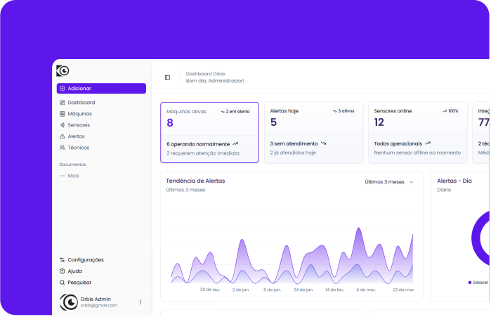

# Orbis

<p align="center">
  
</p>

<p align="center">
  Plataforma web para monitoramento industrial preditivo, gestão de ativos, acompanhamento de sensores e atendimento de alertas em tempo real.
</p>

<p align="center">
  <a href="https://nextjs.org"></a>
  <a href="https://react.dev"></a>
  <a href="https://tailwindcss.com"></a>
  <a href="https://socket.io"></a>
  
</p>

---

## Visão Geral

O **Orbis** é o front-end da solução de manutenção preditiva industrial Orbis. A aplicação centraliza dados de máquinas, sensores, alertas, técnicos, administradores, relatórios e interações com uma IA operacional, oferecendo uma experiência responsiva para equipes de gestão e manutenção.

O projeto foi construído com **Next.js App Router**, **React 19**, **Tailwind CSS**, componentes baseados em **Radix UI/shadcn**, gráficos com **Recharts** e comunicação em tempo real via **Socket.IO**.

Back-end relacionado: [gpc186/Orbis-backend](https://github.com/gpc186/Orbis-backend)

## Preview

<p align="center">
  
</p>

## Funcionalidades

- Landing page institucional com tema claro/escuro, navegação suave e suporte a português, inglês e espanhol.
- Autenticação com JWT, refresh token, sessão persistente opcional e recuperação de senha.
- Dashboard administrativo com indicadores, gráficos, tabelas, filtros e atalhos operacionais.
- Dashboard específico para técnicos, com foco em alertas, atendimentos e prioridades do dia.
- Gestão de máquinas, sensores, alertas, técnicos, administradores, perfil e relatórios.
- Fluxo de manutenção com início, acompanhamento, relato e conclusão de atendimento.
- Atualizações em tempo real para leituras de sensores usando Socket.IO.
- Assistente **Orb - IA Preditiva** com contexto de página, histórico de conversas, confirmação de ações e entrada por voz.
- Relatórios e agendamentos com execução imediata, controle de status e destinatários.
- Interface responsiva com feedback visual, skeleton loading, notificações e permissões por perfil.

## Stack

| Camada | Tecnologias |
| --- | --- |
| Framework | Next.js 16, React 19 |
| Estilização | Tailwind CSS 4, shadcn/ui, Radix UI, next-themes |
| Dados e UI | TanStack Table, Recharts, React Hook Form, Zod |
| Tempo real | Socket.IO Client |
| UX | Lucide React, Sonner, Vaul, Lenis, Embla Carousel |
| Integração | REST API, JWT, refresh token |

## Requisitos

- Node.js `>= 20.9.0`
- npm
- API Orbis em execução localmente ou publicada

> O back-end oficial está em [gpc186/Orbis-backend](https://github.com/gpc186/Orbis-backend). Para ambiente local, a API usa por padrão `http://localhost:3333`.

## Configuração

Clone o repositório e instale as dependências:

```bash
git clone https://github.com/Henrique-Fiorotti/orbis.git
cd orbis
npm install
```

Crie o arquivo `.env.local` na raiz do projeto:

```env
NEXT_PUBLIC_API_URL=http://localhost:3333
API_URL=http://localhost:3333
```

| Variável | Onde é usada | Descrição |
| --- | --- | --- |
| `NEXT_PUBLIC_API_URL` | Cliente/browser | Base URL da API para chamadas REST no front-end e conexão Socket.IO. |
| `API_URL` | Server Actions | Base URL usada em ações server-side, como autenticação. |

Se as variáveis não forem informadas, o projeto usa a URL de produção configurada no código.

## Como Rodar

Ambiente de desenvolvimento:

```bash
npm run dev
```

Acesse:

```text
http://localhost:3000
```

Build de produção:

```bash
npm run build
npm run start
```

## Scripts

| Comando | Descrição |
| --- | --- |
| `npm run dev` | Inicia o servidor de desenvolvimento do Next.js. |
| `npm run build` | Gera a build de produção. |
| `npm run start` | Executa a aplicação em modo produção após o build. |

## Estrutura do Projeto

```text
orbis/
+-- app/
|   +-- (public)/          # Landing page, login e recuperação de senha
|   +-- actions/           # Server Actions
|   +-- dashboard/         # Área autenticada e módulos operacionais
|   +-- layout.jsx         # Layout global
+-- components/
|   +-- context/           # Providers de dados do dashboard
|   +-- landing/           # Componentes e traduções da landing page
|   +-- ui/                # Componentes base de interface
|   +-- ...                # Componentes de domínio
+-- hooks/                 # Hooks compartilhados
+-- lib/                   # Normalização, autenticação, permissões e helpers
+-- public/                # Logos, imagens e assets públicos
+-- utils/                 # Cliente HTTP da API
+-- package.json
```

## Integração com a API

A aplicação consome a API Orbis por REST e Socket.IO.

Principais módulos integrados:

- `auth`: login, refresh token e logout.
- `perfil` e `usuarios`: dados do usuário, administradores e técnicos.
- `maquinas` e `sensores`: cadastro, atualização, leitura operacional e status.
- `alertas` e `manutencoes`: priorização, atendimento e histórico.
- `dashboard`: resumo executivo e dados para gráficos.
- `relatorios`: envio imediato e agendamento.
- `dashboard/ia/perguntar`: consultas do assistente Orb.

As chamadas autenticadas enviam:

```http
Authorization: Bearer <accessToken>
```

Para tempo real, o front-end conecta no Socket.IO usando o token da sessão e escuta eventos de novas leituras de sensores.

## Perfis e Permissões

| Perfil | Acesso principal |
| --- | --- |
| `ADMIN` | Gestão completa de máquinas, sensores, usuários, alertas, relatórios e agendamentos. |
| `TECNICO` | Visualização operacional, atendimento de alertas, manutenção e edição do próprio perfil. |

As permissões do dashboard são centralizadas em `lib/dashboard-permissions.js`.

## Deploy

Recomendações para publicação:

1. Configure `NEXT_PUBLIC_API_URL` e `API_URL` no provedor de hospedagem.
2. Garanta que o back-end permita CORS para o domínio do front-end.
3. Execute `npm run build` antes do deploy.
4. Use uma URL HTTPS para produção, principalmente por causa de autenticação, cookies/tokens e APIs de voz do navegador.

O projeto é compatível com plataformas como Vercel, Render, Railway e ambientes Node.js tradicionais.

## Segurança

- Nunca versionar `.env.local`, tokens, chaves privadas ou credenciais.
- Manter segredos do ESP32, banco de dados, e-mail e provedores externos apenas no back-end.
- Revisar permissões ao alterar regras de acesso por perfil.
- Consultar também o arquivo [SECURITY.md](SECURITY.md).

## Contribuição

1. Crie uma branch a partir da branch principal.
2. Implemente a mudança mantendo o padrão visual e estrutural do projeto.
3. Execute `npm run build` para validar a aplicação.
4. Abra um pull request com descrição objetiva, evidências de teste e impactos esperados.

